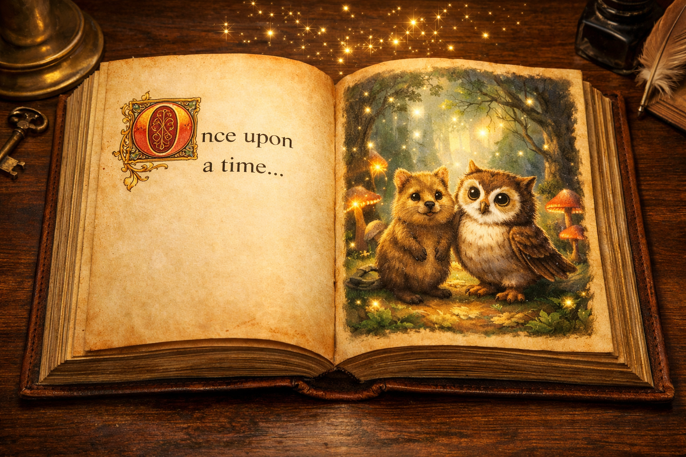
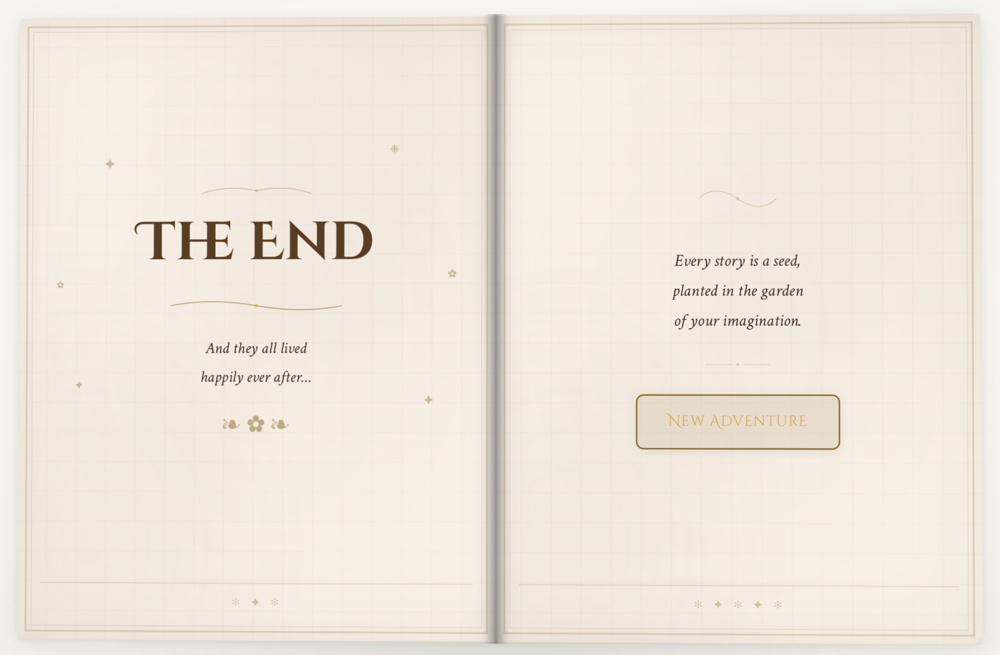

<p align="center">
  
</p>

# TaleWorld

> Interactive AI storybook for children (ages 3-8) — pick a hero, companion, and world, and watch AI write a fairy tale with watercolor illustrations, voice narration, and moral choices, page by page, in a 3D animated book inspired by the Shrek opening scene.

Built for **Mistral AI Hackathon 2026**.

<!-- Add a screenshot or GIF of the storybook UI here -->
<!--  -->

## Features

- **Guided or freeform** — pick hero + companion + world from cards, or describe any story in your own words
- **Multi-chapter generation** — 3-5 chapters streamed in real-time via SSE, each arriving as you read
- **Watercolor illustrations** — AI-generated per chapter via Mistral Image Gen API (with automatic fallback chain)
- **Voice narration** — ElevenLabs TTS per chapter, persistent audio player that survives page turns
- **Moral choices** — branching decisions at chapter ends, each tied to a life lesson and eco-fact
- **3D storybook UI** — leather cover flip-open, parchment pages, typewriter text reveal, CSS 3D page turns
- **Bedtime mode** — dark muted palette, toggled from the story picker
- **Content safety** — two-layer filter blocks inappropriate themes before story generation begins
- **Progressive loading** — text appears immediately, illustrations and audio arrive asynchronously while you read
- **Parent summary** — lessons learned, eco facts, and choices recap at the end

## How It Works

```
Login  -->  Pick Your Adventure  -->  3D Storybook  -->  Summary
            (guided or freeform)      (read & choose)    (for parents)
```

1. **Pick your adventure** — choose a hero (girl / boy / animal / creature), a companion (fox, owl, turtle, dolphin, rabbit, butterfly), and a world (enchanted forest, ocean depths, mountains, arctic) — or switch to freeform mode and describe your own story in a prompt
2. **AI writes the story** — a pipeline of specialized agents generates chapters one by one, each with an illustration and audio narration
3. **Read the storybook** — a 3D animated book with leather cover, parchment pages, typewriter text reveal, page-turn animations, and embedded audio player
4. **Make choices** — at key moments the child picks a path (each tied to a moral lesson and eco-fact)
5. **The End** — parent summary with lessons learned and a "New Tale" button

## Tech Stack

| Layer | Technology |
|-------|------------|
| Frontend | React 19, TypeScript, Vite 7, Tailwind CSS 4, Framer Motion |
| Backend | Python 3.13, Google ADK (multi-agent), FastAPI, LiteLLM |
| Story LLM | Mistral via LiteLLM |
| Illustrations | Mistral Image Gen API (fallback: Pollinations, placeholder) |
| Voice narration | ElevenLabs TTS |
| Deployment | Docker Compose (backend + frontend) |

## Quick Start

### Docker (recommended)

Requires Docker and Docker Compose v2.

```bash
# 1. Configure API keys
cp storytelling/.env.example storytelling/.env
# Edit storytelling/.env — set MISTRAL_API_KEY and ELEVENLABS_API_KEY

# 2. Launch
./start.sh

# Frontend → http://localhost:4173
# Backend  → http://localhost:8000
```

The `start.sh` helper supports additional commands:

```bash
./start.sh --build   # force-rebuild images (needed after changing VITE_* env vars)
./start.sh down      # stop and remove containers
./start.sh logs      # follow logs from all services
```

The stack consists of two services defined in `docker-compose.yml`:
- **backend** — FastAPI + ADK agents, serves API on port 8000 (includes `/audio` static mount for narration files)
- **frontend** — Vite production build served on port 4173

Audio files are persisted in a Docker volume (`audio_files`) between restarts. The backend includes a health check — the frontend container waits for it before starting.

### Local Development

**Backend:**

```bash
cd storytelling
python -m venv .venv
source .venv/bin/activate
pip install -r requirements.txt

# Set env vars
export MISTRAL_API_KEY=xxx
export ELEVENLABS_API_KEY=xxx

# Option A: FastAPI server
python main.py                                      # port 8000

# Option B: ADK dev UI
adk web . --allow_origins="http://localhost:5173"   # port 8000
```

**Frontend:**

```bash
cd frontend
cp .env.example .env    # defaults: mock mode, storyteller/taleworld login
npm install
npm run dev -- --host 0.0.0.0                       # port 5173
```

Set `VITE_API_MODE=local` in `frontend/.env` to connect to the backend. With `VITE_API_MODE=mock` (default) the frontend uses a hardcoded story — no backend needed.

**Default login:** `storyteller` / `taleworld`

## Agent Architecture

```
storytelling_pipeline (SequentialAgent)             root agent
|
+-- prompt_parser_agent (LlmAgent)                  parses prompt, content safety filter
|     tool: save_prompt_settings()                  blocks violence/horror/NSFW
|
+-- story_loop (LoopAgent, max 5)                   repeats per chapter
    +-- chapter_agent (SequentialAgent)
        |
        +-- story_writer_agent (LlmAgent)           writes ONE chapter
        |     tool: save_chapter()                  Guard 1: max chapters, Guard 2: wait for illustration
        |
        +-- media_agent (ParallelAgent)             runs AFTER chapter is written
            |
            +-- image_agent (LlmAgent)              Mistral Image Gen API + fallback chain
            |     tool: generate_images()
            |
            +-- audio_agent (BaseAgent)             ElevenLabs TTS (no LLM, direct API)
```

Each chapter flows through the pipeline sequentially: text first, then illustration + audio in parallel. The frontend receives events via SSE and updates the book progressively — the child can start reading while the illustrator "paints" and the narrator "records."

## Project Structure

```
storytelling/                            Backend (Google ADK + FastAPI)
+-- main.py                              FastAPI entry point
+-- requirements.txt
+-- Dockerfile
+-- storytelling_agent/
|   +-- agent.py                         root agent export
|   +-- chapter_agent.py                 SequentialAgent + LoopAgent
|   +-- story_writer_agent.py            LLM story generation
|   +-- prompt_parser_agent.py           prompt parsing + content safety
|   +-- media_agent.py                   ParallelAgent (audio + image)
|   +-- audio_agent.py                   ElevenLabs TTS (BaseAgent, no LLM)
|   +-- image_agent/
|   |   +-- agent.py                     LlmAgent for illustration
|   |   +-- character_dna.py             per-character visual descriptions
|   |   +-- prompts.py                   StyleBible + prompt composition
|   |   +-- providers/
|   |       +-- mistral_imagegen.py      PRIMARY: Mistral Image Gen API
|   |       +-- pollinations.py          FALLBACK: free API
|   +-- tools/
|       +-- prompt_tools.py              save_prompt_settings() + BLOCKED_WORDS
|       +-- story_tools.py               save_chapter() + Guards
|       +-- image_tools.py               generate_images() + fallback chain
|       +-- audio_tools.py               generate_audio() + ElevenLabs
|       +-- audio_server.py              HTTP server for audio files
+-- tests/

frontend/                                React app (Vite + TypeScript + Tailwind)
+-- Dockerfile
+-- .env.example
+-- src/
    +-- pages/
    |   +-- LoginPage.tsx                "Magic word" credential gate
    |   +-- StoryPickerPage.tsx          Hero + companion + world selection
    |   +-- StoryReaderPage.tsx          SSE integration + Book orchestrator
    |   +-- SummaryPage.tsx              Parent recap (lessons, eco facts)
    +-- components/
    |   +-- Book.tsx                     State machine: closed -> opening -> reading -> ended
    |   +-- BookCover.tsx                3D leather cover with gold title + flip animation
    |   +-- BookSpread.tsx               Two-page spread: left (text) + right (illustration)
    |   +-- PageLeft.tsx                 Typewriter text + dropcap + choices + audio
    |   +-- PageRight.tsx                Illustration with ornamental frame
    |   +-- PageRightText.tsx            Dual-text mode (right page with story text)
    |   +-- PageTurn.tsx                 CSS 3D page-flip animation
    |   +-- PageOrnaments.tsx            SVG vignettes for page decoration
    |   +-- TheEnd.tsx                   Final page + "New Tale" button
    |   +-- AudioPlayer.tsx              Play/pause narration (persistent across pages)
    |   +-- LoadingQuill.tsx             Quill pen spinner for illustration loading
    |   +-- WorldScene.tsx               CSS-drawn animated scenes per world
    |   +-- LoadingScene.tsx             Animated loading with mountains, sun, clouds
    |   +-- AuthContext.tsx              In-memory auth (env var credentials)
    +-- hooks/
    |   +-- useTypewriter.ts             Word-by-word text reveal with cursor
    |   +-- useTextPagination.ts         Splits chapter text into pages that fit on screen
    |   +-- useSpeechInput.ts            Web Speech API (optional mic input)
    +-- lib/
        +-- api.ts                       generateStory() — mock/live SSE mode
        +-- sseClient.ts                 fetch-based SSE client for POST /run_sse
        +-- types.ts                     Story, Chapter, StoryRequest, BookState, etc.
        +-- mockData.ts                  Hardcoded 3-chapter story fixture
```

## Storybook UI

The reading experience is a 3D animated book rendered entirely in CSS + Framer Motion — zero canvas, zero WebGL, zero image assets for the book itself:

- **Leather cover** with embossed gold title, heraldic emblems (fox, owl, turtle, butterfly), and a 3D flip-open animation
- **Parchment pages** with CSS-only linen texture
- **Typewriter effect** — text reveals word-by-word with a blinking cursor
- **Dual-page spreads** — left: story text with illuminated dropcap; right: watercolor illustration or continuation text
- **3D page turns** — CSS `perspective` + `rotateY` flip animation between spreads
- **Audio narration** — persistent `<audio>` element survives page turns; compact toggle on every page
- **Moral choices** — slide-up buttons after typewriter finishes on the last page of a chapter
- **Bedtime mode** — dark theme with muted navy/gold palette

Typography: **Cinzel Decorative** (titles, dropcaps), **Crimson Text** (story body), **Fraunces** (app headings), **DM Sans** (app body).

## Environment Variables

### Backend (`storytelling/.env`)

| Variable | Required | Description |
|----------|----------|-------------|
| `MISTRAL_API_KEY` | Yes | Mistral API (LLM + Image Gen) |
| `ELEVENLABS_API_KEY` | Yes | ElevenLabs TTS |

### Frontend (`frontend/.env`)

| Variable | Default | Description |
|----------|---------|-------------|
| `VITE_AUTH_USERNAME` | `storyteller` | Login username |
| `VITE_AUTH_PASSWORD` | `taleworld` | Login password |
| `VITE_API_MODE` | `mock` | `mock` = hardcoded data, `local` = ADK backend |
| `VITE_API_BASE_URL` | `http://localhost:8000` | Backend URL |

## Content Safety

Two-layer filter designed for a children's audience:

1. **Prompt filter** — checks user input against 58 blocked words and 8 blocked phrases (violence, horror, NSFW, substances, self-harm) before any generation starts
2. **Image filter** — illustration prompts are sanitized; Mistral Image Gen and Pollinations enforce `safe=true`

When blocked, the book cover displays a friendly "This story cannot be told" message instead of opening.

## License

Hackathon project — Mistral AI Hackathon 2026.

<p align="center">
  
</p>
